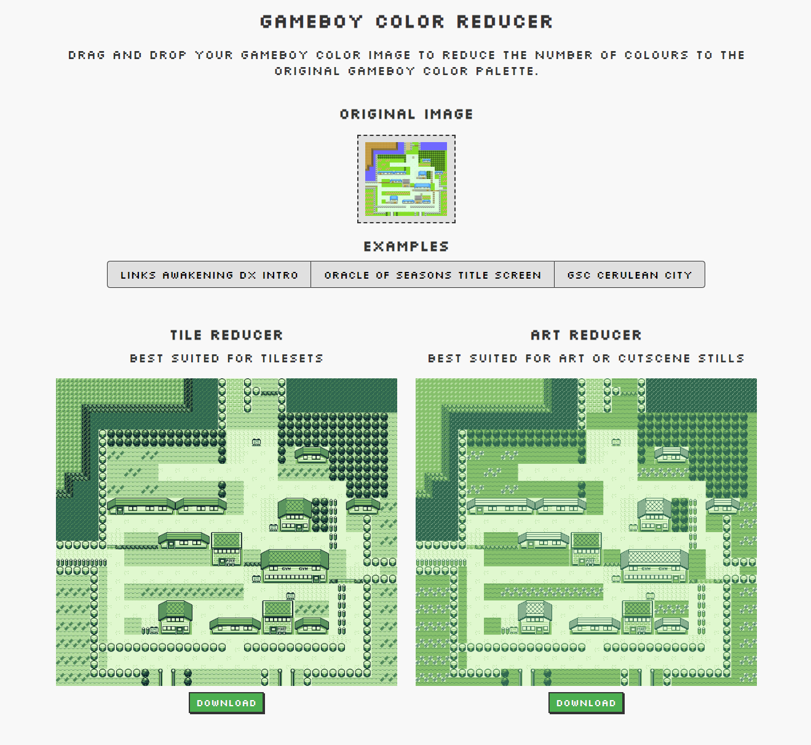
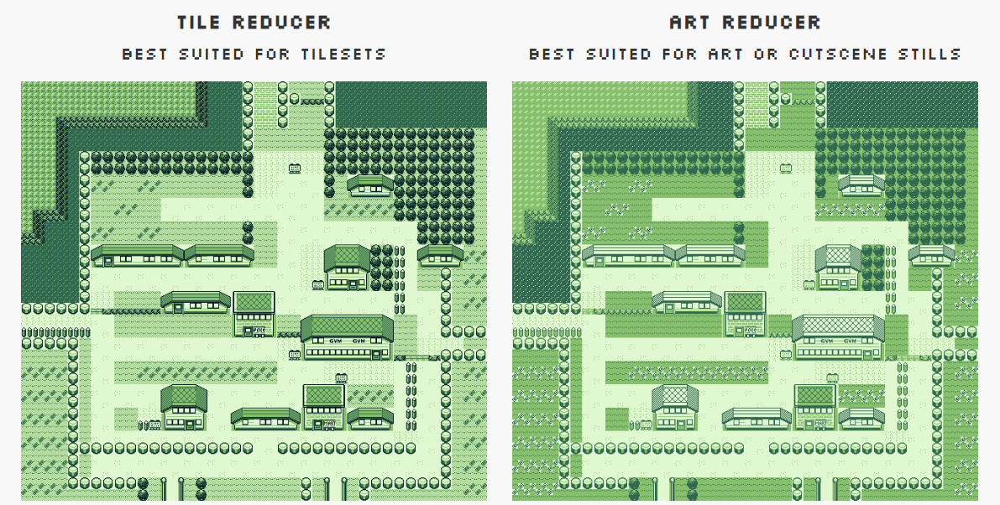
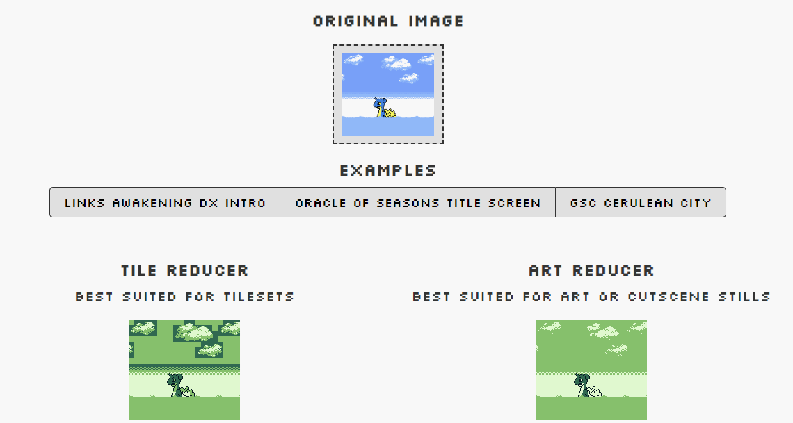

# Gameboy Color Reducer
Reduce/decrease/simplify Gameboy Color images images online to the four colours of the original Gameboy (DMG).

[Try it right now via GitHub Pages!](https://nikouu.github.io/GameboyColorReducer/)

Check out the example buttons to get started, or use your own image. All images are processed in-browser.

## Why two algorithms?

Primarily this project is about the tile reducer. It's aimed at tilemaps with discrete borders and boundaries containing colours in tidy 8x8 pixel tiles. 

In the example below, the tile reducer gives proper tile definition by looking at each colour in every tile.

Looking at the art reducer on the right shows flattned colours and some definition washed out. However it still serves an important role to give us options.

The art reducer is a nearest neighbour quantizer, similar to what GB Studio uses. This flattens colours and washes out some definition, but also prevents odd blocks of colour in more artistic pictures.

Check out the lapras part of the Pokemon Silver title screen cutscene:

The clouds look blocky due to a tile approach, but look smooth in the art approach - even if some of the definition from darker colours are lost.

Note: 
1. It may be impossible to properly colour some art because the "four colour per tile" hardware limitation can be worked around by mixing backgrounds and sprites. See [Creating A “Reward” Scene](https://gbstudiocentral.com/tips/putting-together-a-flashy-scene/) by 
Gumpy Function for more
2. The art function is not the goal of this project. It's put in for fun 🤷‍♀️

## Previous work

This work builds on my previous command line tool: [GameboyColour-Decolouriser](https://github.com/nikouu/GameboyColour-Decolouriser). This post explains the basis around how the tile colour reduction algorithm works.

## Technology

This is a WebAssembly project via Blazor AOT and C#.

## Acknowledgements

- This project uses [ImageSharp](https://github.com/SixLabors/ImageSharp) by Six Labors, which is licensed under the Apache License 2.0.
- Images from benchmarking and testing via [The Spriters Resource](https://www.spriters-resource.com/) or myself.
